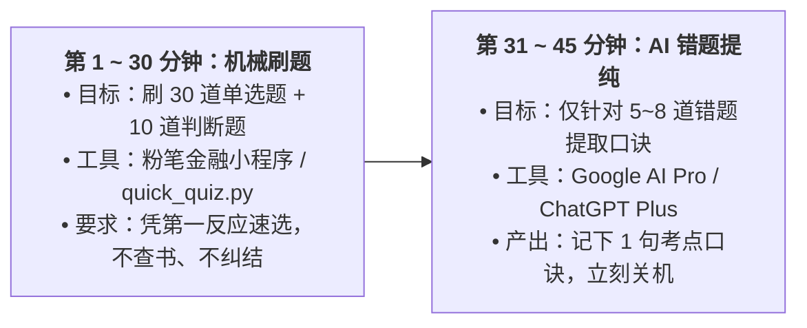

# ⏱️ 每日 45 分钟极简流水线与 20 天冲刺看板

> **原则**：每天仅在固定时段（建议 14:30 - 15:15）投入 45 分钟。闹钟一响立即开始，闹钟一响立即合上。严禁把备考情绪带入其他时段。
> 
> 🔗 **备考基地直达**：[🏛️ Obsidian 通关总控台](本地全量资料库/00-备考总控与大纲看板/00_2026银行从业·通关总控台.md) ｜ [🧮 个人理财 TVM 公式手册](本地全量资料库/02-个人理财/01_货币时间价值TVM公式手册与计算器实战.md) ｜ [🗺️ 重点资料星级地图](本地全量资料库/04-重点资料导航与重要等级地图.md)

---

## 🔄 每日 45 分钟工业化时间切片



---

## 🤖 错题投喂 AI 专属 Prompt 模板

遇到做错的题目或记不住的数字指标，直接截图或复制文字扔给 **Google AI Pro** 或 **ChatGPT Plus**：

```text
这是我做错的一道 2026 初级银行从业资格考试题目：
【粘贴题目与选项】

请用极简结构回答：
1. 核心考点：用不超过 20 个字说明考核的知识点；
2. 正确选项理由：为什么选这个；
3. 记忆口诀：给出一个通俗好记的口诀或数字助记法（15字以内）。
```

---

## 📅 20 天通关冲刺打卡矩阵

### 第一阶段：《银行业法律法规与综合能力》（Day 1 ~ Day 10）

| 天数 | 核心模块 | 每日指标 | 完成打卡 | 错题数 |
| :---: | :--- | :--- | :---: | :---: |
| **Day 1** | 宏观经济金融基础 (货币政策、通胀、GDP) | 30 单选 + 10 判断 | [ ] | |
| **Day 2** | 金融体系与机构变革 (金融监管总局职责、金控公司) | 30 单选 + 10 判断 | [ ] | |
| **Day 3** | 商业银行负债业务 (个人存款、单位存款、同业拆借) | 30 单选 + 10 判断 | [ ] | |
| **Day 4** | 商业银行资产业务 (贷款五级分类、表外业务) | 30 单选 + 10 判断 | [ ] | |
| **Day 5** | 银行资本管理与巴塞尔协议 Ⅲ (三大资本充足率指标) | 30 单选 + 10 判断 | [ ] | |
| **Day 6** | 风险管理与流动性指标 (信用/市场/操作风险定义) | 30 单选 + 10 判断 | [ ] | |
| **Day 7** | 担保物权与民法典衔接 (抵押 vs 质押) | 30 单选 + 10 判断 | [ ] | |
| **Day 8** | 反洗钱三大制度与刑法涉银罪名 | 30 单选 + 10 判断 | [ ] | |
| **Day 9** | 银行业从业人员职业操守与合规准则 | 30 单选 + 10 判断 | [ ] | |
| **Day 10** | 《法律法规》全真模考一套 (90单选+40多选+15判断) | 满分100，达标60 | [ ] | |

---

### 第二阶段：《个人理财》（Day 11 ~ Day 20）

| 天数 | 核心模块 | 每日指标 | 完成打卡 | 错题数 |
| :---: | :--- | :--- | :---: | :---: |
| **Day 11** | 个人理财概述与客户生命周期特征 | 30 单选 + 10 判断 | [ ] | |
| **Day 12** | 货币时间价值 TVM 公式 (复利现值/终值计算) | 20 计算单选 + 10 判断 | [ ] | |
| **Day 13** | 普通年金现值/终值与财务计算器按法 | 20 计算单选 + 10 判断 | [ ] | |
| **Day 14** | 银行理财产品与净值化转型 (资管新规规范) | 30 单选 + 10 判断 | [ ] | |
| **Day 15** | 基金、信托与保险产品特性对比 | 30 单选 + 10 判断 | [ ] | |
| **Day 16** | 客户风险承受能力评估 (KYC原则与适当性匹配) | 30 单选 + 10 判断 | [ ] | |
| **Day 17** | 理财业务相关法律法规 (合格投资者认定门槛) | 30 单选 + 10 判断 | [ ] | |
| **Day 18** | 理财师工作流程与综合理财规划书制作 | 30 单选 + 10 判断 | [ ] | |
| **Day 19** | 高频易错点专题特训 (税收筹划、黄金外汇) | 30 单选 + 10 判断 | [ ] | |
| **Day 20** | 《个人理财》全真机考模拟一套 | 满分100，达标60 | [ ] | |
