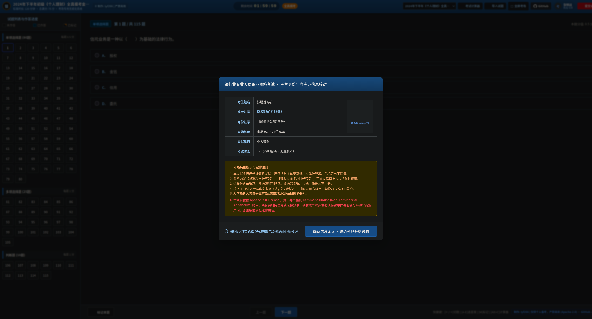
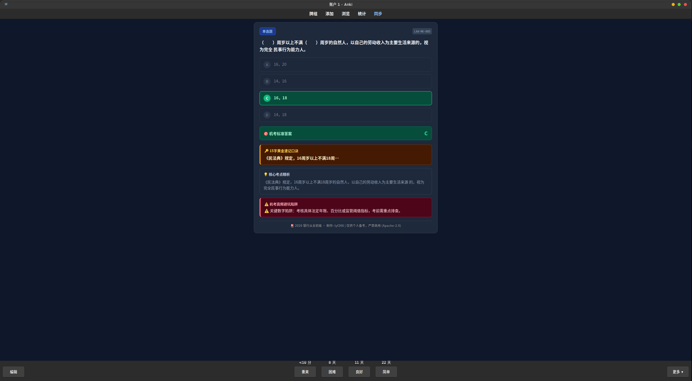

# 🏦 2026 银行从业初级资格备考工具箱 (bank-exam-2026-toolkit)

[-blue.svg)](LICENSE)

> **一套专注“少走弯路、高效通关”的 2026 银行业专业人员初级职业资格备考工程化工具箱。**  
> 融合 **710 题 Anki 科学卡包矩阵** 与 **1:1 ATA 官方机考仿真平台**，全客观题全量解析，直达 60 分及格线。

---

## 🚀 线上免安装即刻体验 (Online Demo)

无需下载安装任何软件，在任何浏览器（PC / 平板 / 手机）均可免登录即刻实机模考：

👉 **[点击直接进入：2026 银行从业 1:1 ATA 全真机考模拟系统 (Live Demo)](https://lyf266.github.io/bank-exam-2026-toolkit/)**

*(默认载入：2024年下半年初级《个人理财》全真模考金题卷 115 题)*

---

## 📸 实机演示与卡包预览 (Screenshots)

### 🖥️ 1. 1:1 ATA 官方全美在线考务机考仿真系统 (Web 网页端)
120 分钟倒计时、全真准考证核验、题号方阵无缝切题、考场专用双模式悬浮计算器（含理财 TVM 年金运算）：

### 🎴 2. Anki 智能客观题记忆卡包 (电脑端 / 手机端)
Fisher-Yates 原生动态乱序洗牌、15 字秒杀口诀、核心考点精析、审题避坑指南与 FSRS 遗忘曲线调度：

---

## ⚡ 极速上手 (Quick Start)

### 方案 A：Web 网页端全真模考（推荐：模考实战、考前冲刺）
* **线上直接用**：点击上方 [Live Demo](https://lyf266.github.io/bank-exam-2026-toolkit/) 链接即可开始作答。
* **本地离线用**：克隆仓库后，双击根目录的 `index.html` 即可离线启动（无需后端、零配置）。

### 方案 B：Anki 智能记忆卡包（推荐：通勤刷题、长期抗遗忘）
1. 安装 [Anki](https://apps.ankiweb.net/)（PC / Mac / iOS / Android 均支持）；
2. 双击导入本仓库 `anki/` 目录下的卡包：
   * `2026银行从业初级_全真套题全量卡包.apkg`（全量 710 题完整体系）
   * `2026银行从业初级_全真机考客观题.apkg`（核心客观题精炼版）
3. 自动绑定 FSRS 记忆算法，开箱即刷。

---

## ✨ 五大核心特性 (Key Features)

### 1. 🎲 原生动态选项随机乱序 (Fisher-Yates 算法)
* **拒绝位置作弊**：传统刷题容易记住“这道题选 C”，本卡包内置原生 JavaScript 洗牌引擎，每次复习时单选/多选题选项位置与 A/B/C/D 标签**动态随机重排**；
* **翻面精准映射**：背面的答案标注与最新乱序位置严格对齐，并附注原题标准答案，彻底强化题干法理与逻辑记忆（判断题智能保真不乱序）。

### 2. 🧠 新一代 FSRS 科学间隔重复算法
* **告别复习海啸**：全面摒弃过时的传统 SM-2 线性估算算法，接入 Anki 原生 **FSRS (DSR 认知模型)**；
* **精准记忆调度**：基于难度 (D)、稳定性 (S)、可提取性 (R) 动态拟合遗忘曲线，在保证 90% 目标保持率的前提下，**日常复习题量直降 30%+**。

### 3. 🖥️ 1:1 官方 ATA 考务机考仿真与自动评分
* **像素级真实考场**：全美在线 (ATA) 经典深蓝考务顶栏、120 分钟倒计时警示、左侧题号矩阵（已答蓝、未答灰、已标记橙色三角旗角标 `M` 键快捷标记）；
* **考后红绿错题复盘**：一键自动判定单选/多选/判断正误，生成官方准考证成绩单，自动开启错题逐题精析。

### 4. 🧮 考场专用双模式悬浮计算器 (`Alt + C`)
* **科学计算器**：支持 $x^y, \sqrt{x}, e^x, \ln, \log$ 等复杂运算；
* **理财专向 TVM 模式**：原生提供 $N, I/Y, PV, PMT, FV$ 五键解算，支持普通年金 (END) 与期初年金 (BGN) 一键切换，秒杀复利终值、永续年金、等额本息房贷还款期计算。

### 5. 🔥 2026 现行规范全量校准 & 四步公式推导
* **彻底清除过时考点**：严格按 2024~2026 现行法律与监管标准重构：
  * 监管主体全面更正为**国家金融监督管理总局 (NFRA)**；
  * 货币统计口径更新：央行自 **2025年1月** 起实施新口径，“个人活期存款”与“非银支付机构备付金”已正式计入 **M1**；
  * 全面适用《民法典》（物权编、合同编、继承编）及资管新规全面净值化；
* **出版级 KaTeX 数学排版**：理财计算题彻底告别混乱代码，统一以 **①公式原形 $\to$ ②代入数据 $\to$ ③逐步推导 $\to$ ④结论** 呈现。

---

## 📚 试题库收录矩阵 (591+ 题权威真题)

| 试卷编号 / 名称 | 科目 | 题量 | 适用场景 |
| :--- | :--- | :---: | :--- |
| **2025年10月最新机考回忆卷** | 法律法规 / 个人理财 | 43 题 | 最新场次考纲动向（含先付年金/养老三支柱） |
| **2024年下半年全真模考金题卷** | 法律法规 / 个人理财 | 240 题 | 考前 120 分钟冲刺全仿真 |
| **2024年06月全真机考真题卷** | 法律法规 / 个人理财 | 239 题 | 官方高频核心机考真题带刷 |
| **2023年历次机考回忆原题卷** | 法律法规 / 个人理财 | 48 题 | 摸清近三年命题题库常考点 |
| **2026 双科冲刺仿真模考卷** | 法律法规 / 个人理财 | 29 题 | 快速自测与母题温故 |

---

## 🌟 欢迎 Star 支持

如果觉得这个项目对您的银行从业资格备考有所帮助、界面体验扎实，**诚挚邀请您在 GitHub 页面右上角点一个 ⭐️ Star 支持一下！**

您的每一个 Star 都是对作者持续追踪 2026 最新监管新规、打磨全真机考题库的最大鼓励，非常感谢！🙏

---

## 📜 开源协议与非商业免责声明 (License & Non-Commercial Notice)

本项目依据 **[Apache-2.0 License](LICENSE)** 开源，并严格受 **Commons Clause (Non-Commercial Addendum)** 约束：

> **⚠️ 严禁商业转售声明：**  
> 1. 本项目所有代码、网页系统、Anki 卡牌包（.apkg）及题库数据集**仅供个人备考与学习研究免费使用**；  
> 2. **严禁任何个人、机构或培训组织将本项目的全部或任何部分用于商业牟利行为**（包括但不限于倒卖卡包、打包进付费课程、置于付费知识库或作为有偿培训资料等）；  
> 3. 转载或二次开发必须保留原作者署名与开源非商业声明，否则将依法追究法律责任。

**制作署名**：lyf266  
**项目维护**：[https://github.com/lyf266/bank-exam-2026-toolkit](https://github.com/lyf266/bank-exam-2026-toolkit)
